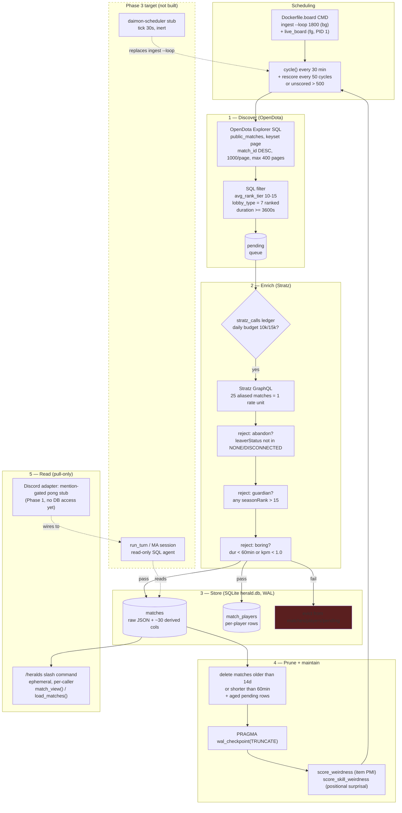

# Herald Architecture — Scraping Flow & System Understanding

> Generated 2026-09-07 from a full-repo investigation (code, tests, `.planning/`, deploy configs).
> The old flat bot (`discord_bot.py` / `functions.py`) no longer exists — this doc describes what is actually in the repo today.

## 1. What this codebase is

**Herald Reviews Scout** — a Discord bot for streamer Jenkins that surfaces Dota 2 **Herald-bracket**
matches worth featuring on his "Herald Reviews" series. It quietly ingests recent valid Herald
matches into a database (pruning old ones) and answers on demand. **Pull-only is the founding
constraint** (DISC-01): it never posts unprompted — the scheduled auto-posting behavior that
annoyed the server was killed entirely.

Two stacks coexist in the repo:

| Stack | Location | State | Role |
|---|---|---|---|
| **v1 SQLite pipeline (live prod)** | `scripts/ingest.py` + `spikes/menu-v2/live_board.py`, `herald.db` (WAL) | Running today on Fly app `herald-board` | The real scrape → store → board flow |
| **daimon fork (overhaul scaffold)** | `packages/core` + `packages/adapters/{discord,scheduler}`, Postgres + Alembic | Phase 1: pong-only Discord bot, inert scheduler stub, empty DB baseline | Target architecture; Q&A agent + migrated ingest land here later |

## 2. Scraping flow diagram

### End-to-end walk (one `cycle()` in `scripts/ingest.py`)

1. **Schedule.** `Dockerfile.board` runs `python -u scripts/ingest.py --loop 1800` in the
   background next to `live_board.py` on the `herald-board` VM (`HERALD_DB=/data/herald.db`,
   volume `herald_data`, 2 vCPU / 2 GB). One `cycle()` = `discover()` → `enrich()` → `prune()` →
   WAL checkpoint. Other modes: `--backfill DAYS`, `--recompute`, `--weirdness`, single-cycle
   default, and offline `--selfcheck/--skillcheck/--signalcheck` (run with no env vars).
2. **Discover.** Keyset-walk of OpenDota `public_matches` newest-first (`Explorer`, 1.1 s sleep/page).
   SQL predicate: `avg_rank_tier BETWEEN 10 AND 15`, `lobby_type = 7` (ranked-only, locked 2026-07-12),
   `duration >= DUR_MIN` (3600 s since 2026-07-13). Novel IDs → `pending` table. Stops at the
   14-day retention horizon, a fully-known page (frontier), or `MAX_PAGES=400`. A failed discover
   is logged and the cycle continues with what it has.
3. **Enrich.** Drain `pending` FIFO (`discovered_at < now-180s`, `attempts < 8`, ≤200 requests/cycle).
   Each Stratz call aliases `STRATZ_BATCH=25` full matches into **one** GraphQL request costing
   exactly one rate-limit unit (verified live). Daily spend is tracked in `stratz_calls` against
   `STRATZ_DAILY_BUDGET=10000` (⅓ headroom under the 15k free cap). Per match, in order:
   `has_abandon` → `has_guardian` → `dur_boring` → `low_kpm`; failures are **evicted** from all
   tables, survivors go through `upsert_match()` (INSERT OR REPLACE + derived columns + full raw
   JSON, then delete-and-reinsert player rows). Not-ready matches get `attempts+1`, dropped at 8.
4. **Parse / derive.** No dataclasses — raw Stratz JSON is kept verbatim in `matches.raw`, and
   ~30 derived sort/filter columns (`kpm`, `lead_flips`, `comeback_gold`, `gold_swings`,
   `weirdness`, `skill_weirdness`, …) are precomputed at write time so the board never scans
   1.5 GB of JSON at boot. `match_view()` is the single source of truth for derived semantics and
   must match the board's copy exactly. Corpus-relative scorers run as streaming passes:
   item-build weirdness (hero-vs-corpus PMI, ≥1000 g purchases) and skill-order weirdness
   (positional surprisal `-log P(ability|hero,mode,index)`, ult-early discounted 0.5×).
5. **Store.** SQLite `herald.db` in WAL mode (`busy_timeout=30 s` so board reads and ingest writes
   coexist). Tables: `matches` (PK `match_id`), `match_players` (PK `(match_id, slot)`),
   `pending` (discovery queue), `stratz_calls` (budget ledger). Schema drift is handled by a list
   of `ALTER TABLE … ADD COLUMN` in `try/except OperationalError: pass`.
6. **Prune.** Delete matches older than `RETENTION_DAYS=14` **or** shorter than `DUR_MIN` (the
   second clause sweeps pre-pivot Turbo/short games every cycle), plus aged `pending` rows
   (kept loose — a backfill can take days against the Stratz cap). Then `wal_checkpoint(TRUNCATE)`
   so the board's long-lived reader doesn't pin unbounded WAL growth.
7. **Read (pull-only).** Today's surface is the `/heralds` slash command (`defer(ephemeral=True)`):
   private board per caller via `load_matches()` → `match_view()`. The daimon Discord adapter is
   still a Phase-1 stub (`HeraldBot.on_message`: ignore self, ignore unless `@mentioned`, reply
   `"pong"`). The SQL-writing Q&A agent is a later phase; `DiscordRuntime` already injects
   `sessionmaker` + `AsyncAnthropic` but nothing calls them yet.

### Entry points & deploy topology

| Command | Wired in | Notes |
|---|---|---|
| `python scripts/ingest.py --loop 1800` (bg) + `live_board.py` (fg) | `Dockerfile.board`, Fly app `herald-board` (sjc) | The running pipeline; no health check — PID 1 is liveness |
| `python -m daimon.adapters.discord` | `fly.toml` `[processes] discord`, `docker-compose.yml` | Test-twin app `herald-scraper-bot-test` (sea); prod app untouched per D-03 |
| `alembic upgrade head` | `fly.toml` `release_command`, compose `migrate` service | Baseline migration is an intentional no-op (zero domain tables yet) |
| `daimon-scheduler` | Importable only, not wired into Fly | Inert stub; Phase 3 replaces its body with the ingest loop |

### Retries & error handling

- `explorer_fetch`: 4 attempts; 5 s on exception/5xx/SQL-err, 10 s on 429; returns `None` → discover degrades gracefully.
- `stratz_fetch_batch`: 3 attempts; 3 s on exception, 30 s on 429; returns `"RATELIMIT"` sentinel → cycle ends **without** burning pending attempts.
- Loop-level `try/except` around each `cycle()` — a bad cycle never kills the process; container restarts via `unless-stopped` / Fly.
- daimon-core side: `DaimonError` taxonomy (`ConfigError`, `StoreError`, `TurnError{interrupted, interrupt_timeout, connection_lost, upstream, reducer_bug}`, …); turn driver retries `APIConnectionError` twice with SSE reconnect → `replay_events` → re-fold from last `status_idle` boundary (dedup via `seen_event_ids`); 409 version-conflict retried once; 404-tolerant deletes.
- OOM hardenings from real incidents (all regression-locked in `tests/test_herald_board_regression.py`): streamed `recompute()` (a `.fetchall()` once OOM-killed the 1 GB VM), limit-bounded `load_matches()`, precomputed derived columns, per-cycle WAL checkpoint.

## 3. Notable design decisions

- **OpenDota discovers, Stratz enriches** (spike-validated): OD is the only Herald ID feed (~2k/day); Stratz is the only parsed detail (OD Herald matches are ~always unparsed). Aliased batching + daily budget keep the free tier viable.
- **Rank filter is two-stage and tightened twice**: SQL `10–15` + ranked-only, then per-player `seasonRank > 15` / abandon / 60-min / 1.0-KPM eviction. Known gap: bakeoff recommended a literal `stratz bracket == 1` re-filter; code uses the stricter-in-spirit per-player predicate instead.
- **Own-IP rule**: Stratz "opinion" fields (`heroAverage`, `imp`, predictions) are excluded — watchability scoring (PMI weirdness, positional surprisal, gold swings, receipts) is the bot's IP.
- **Ponytail ingest**: one file, stdlib `sqlite3`, sync `httpx`, dicts — deliberately not importing legacy modules that enforce env vars at import. The Postgres/daimon design (SQLAlchemy + asyncpg + Alembic, 30-day retention) is the planned target; SQLite + 14-day retention is the shipped reality.
- **Bot ranks, human picks**: comedic payload is uncomputable — the bot surfaces candidates, Jenkins chooses.
- **Pull-only everywhere**: mention-gated stub, ephemeral `/heralds`, write-only ingest (ING-06), read-only SQL tool for the future agent (QRY-02). The standing channel board + timer re-render was deleted after the 2026-09-05 DB-lock/CPU/OOM incident and is now test-forbidden.
- **Config hygiene**: nested `DAIMON_*` pydantic-settings with `SecretStr` on tokens (D-11), `.env.example` committed, leaked Telegram token revoked via `git filter-repo`.
