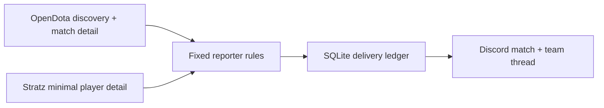
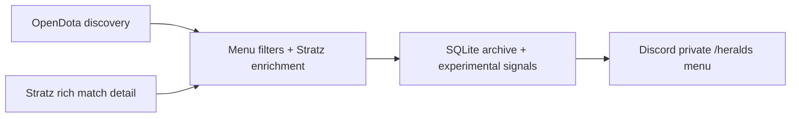
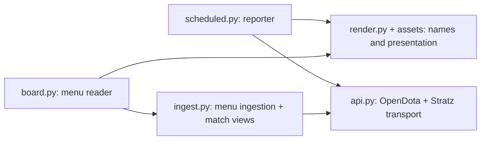

# Herald

Dota 2 Herald matches worth reviewing. **Two modes; the menu is opt-in.**

| Mode | Run | Behavior |
| --- | --- | --- |
| Reporter | `python -m herald scheduled --loop` | Cheap background scrape of one delayed day; fixed rules, one match embed + two team embeds in its thread. |
| Experimental menu | `python -m herald menu` | Private `/heralds` browser: filters, sorting, item builds and skill orders. Reads an archive populated separately. |

The reporter preserves the legacy selection used for the 95-post run: duration **>4,500s**, average rank **≤16**, no Stratz player rank **>15**, ten players and **OpenDota leaver status 0** for each. Missing accounts/leaver evidence rejects the match; unknown account rank is allowed. No KPM/lobby cutoff, LLM summaries or ranking framework. Default window: four days ago to three days ago; repeat 24 hours after each pass.

<details>
<summary><strong>Data flows and shared code</strong></summary>

Reporter flow:



Menu flow (different eligibility: rank 10–15, ranked lobby, ≥60min, ≥1 KPM by default):



Shared code; the reporter never imports menu policy:



</details>

**Cost:** local operation needs no paid API or LLM key (within provider quotas); electricity/storage are yours. Fly templates keep a 512MB reporter or 2GB menu machine running. At Fly's lowest-region reference prices, 30 days plus the volumes below is **$3.84 reporter / $13.84 menu**, before egress/snapshots/tax; template regions `sea`/`sjc` can cost more. [Fly pricing](https://docs.fly.io/about/pricing).

The menu ingests rich timelines/chat/builds every 1,800s with the supervisor, retains 14 days and periodically rescores the corpus: more API traffic, SQLite I/O and memory even when nobody opens it. Keep ingestion off unless experimenting; the reader alone can browse a saved archive. Reporter selection never uses that archive.

## Set up locally

Use Linux/macOS (Windows: WSL), Git and [uv](https://docs.astral.sh/uv/getting-started/installation/). `uv sync` installs the pinned Python 3.12 and locked dependencies.

```sh
git clone https://github.com/clsandoval/herald-scraper-bot.git
cd herald-scraper-bot
uv sync --frozen
cp .env.example .env
uv run pytest -q                    # offline; no credentials needed
```

Fill `.env` using **Keys you need** below. These next commands connect online; reporter commands **send Discord posts**. `.env` is loaded only when explicitly passed.

```sh
uv run --env-file .env python -m herald scheduled          # one delayed-day pass
uv run --env-file .env python -m herald scheduled --loop   # background reporter
# Optional recent seven-day one-shot: replace --loop with --backfill 7.
```

Opt into the menu: initialize offline, ingest once (new candidates wait three minutes before enrichment), then ingest again later and open the reader. Stop ingestion when finished; the reader still works.

```sh
uv run --env-file .env python -m herald.ingest --init-db
uv run --env-file .env python -m herald ingest
# After at least three minutes:
uv run --env-file .env python -m herald ingest
uv run --env-file .env python -m herald menu
# Only for continuous experiments (both processes):
uv run --env-file .env python -m herald.menu_service
```

<details>
<summary><strong>Keys you need</strong> — all product environment variables, permissions and quotas</summary>

| Variable | Needed by | Get it / default | Free / paid; rate limit |
| --- | --- | --- | --- |
| `DISCORD_BOT_TOKEN` | Reporter; menu reader | [Developer Portal](https://discord.com/developers/applications) → New Application → name → Create → Bot → Reset Token → copy into `.env`. | No API fee; [Discord limits](https://docs.discord.com/developers/topics/rate-limits) vary by route; honor 429 `retry_after`. |
| `STRATZ_API_TOKEN` | Reporter; menu ingest | [Stratz API](https://stratz.com/api) → Log In with Steam → API → My Tokens → create/copy a token into `.env`. | [Free API](https://github.com/STRATZ-Esports/knowledge-base/issues/31); current allowance shown in My Tokens. [Provider quota reference](https://github.com/STRATZ-eSports/knowledge-base/issues/15) is historical; this repo cannot verify today's token-specific numbers. |
| `DISCORD_CHANNEL_ID` | Reporter only | Discord Settings → Advanced → Developer Mode; right-click destination **server text channel** → Copy Channel ID. [Discord instructions](https://support.discord.com/hc/en-us/articles/206346498-Where-can-I-find-my-User-Server-Message-ID). | Free; ID, no separate quota. |
| `HERALD_REPORT_DB` | Reporter, optional | Local path; default `herald-reports.db`; Fly `/data/herald-reports.db`. Preserve delivery ledger. | Local disk; Fly volume billed. |
| `HERALD_DB` | Menu ingest + reader, optional | Same local path for both; default `herald.db`; Fly `/data/herald.db`. | Local disk; Fly volume billed. |
| `DUR_MIN` | Menu only, optional | Minimum seconds, default `3600`. | Local setting; no quota. |
| `KPM_MIN` | Menu only, optional | Minimum kills/minute, default `1.0`. | Local setting; no quota. |
| `RETENTION_DAYS` | Menu only, optional | Archive retention/discovery days, default `14`. | Local setting; affects storage/traffic. |
| `MAX_PAGES` | Menu only, optional | Explorer pages per discovery, default `400` (100 rows/page). | Local bound; not provider quota. |
| `STRATZ_DAILY_BUDGET` | Menu only, optional | Default `10000` logical batches/UTC day recorded in SQLite; retries are extra HTTP calls. | Local bound; not provider quota. |
| `STRATZ_BATCH` | Menu only, optional | Matches per rich-detail batch, default `25`. | Local setting; not provider quota. |
| `SWING_MIN` | Menu only, optional | Gold reversal threshold, default `3000`. | Local setting; no quota. |

**Invite the bot:** in the Portal app, enable **Guild Install** under Installation. OAuth2 → URL Generator → scopes **`bot` + `applications.commands`** → select permissions below → open generated URL → select your server → Authorize (requires Manage Server). [Discord setup](https://docs.discord.com/developers/quick-start/getting-started).

- Reporter: View Channel, Send Messages, Embed Links, Read Message History, Create Public Threads, Send Messages in Threads.
- Menu: View Channel, Send Messages, Embed Links, Attach Files. Users need Use Application Commands; check channel overrides and server Integrations if `/heralds` is missing.
- Intents: leave **all privileged toggles off** (Presence, Server Members, Message Content). Reporter uses REST; menu uses `discord.Intents.default()` and syncs `/heralds` to joined guilds on startup. No interactions endpoint URL is needed. Both modes read the chosen bot's existing application emojis; none are created, and an empty inventory uses text fallbacks.

**OpenDota needs no key:** both modes call its public API; paid-key support is not implemented. [Upstream defaults](https://github.com/odota/core/blob/master/config.ts) currently specify 60 requests/minute and 3,000/day without a key; production settings can differ. Older 50,000/month claims are not a verified current quota. [Provider API page](https://www.opendota.com/api-keys).

Code safeguards: reporter ≤400 Explorer pages/pass, ≤500 Stratz batches of 25/pass; both pace Explorer at 1.1s/page. Stratz retries up to three times; OpenDota Explorer up to four. These bounds do not reserve provider quota or coordinate different apps sharing a token/IP.

</details>

<details>
<summary><strong>Set up on Fly</strong> — either template, from zero</summary>

These are operator instructions for **live, billed deployments**. No deployment was performed during this refactor. Install [flyctl](https://docs.fly.io/flyctl/install), create a Fly account with billing, then run `fly auth login`. Docker image build uses the root `Dockerfile` for both modes.

Choose globally unique app names; replace `app` in **each corresponding TOML** with your name. Preserve each template's process, volume, region and DB path. Create only the mode(s) you intend to run.

Reporter ([fly.toml](fly.toml), `sea`, 512MB):

```sh
report_app=your-unique-herald-reporter  # also edit app in fly.toml
fly apps create "$report_app"
fly volumes create herald_reports --app "$report_app" --region sea --size 1
grep -E '^(DISCORD_BOT_TOKEN|STRATZ_API_TOKEN|DISCORD_CHANNEL_ID)=' .env | fly secrets import --app "$report_app"
fly deploy --config fly.toml --ha=false
fly status --app "$report_app"
fly logs --app "$report_app"
```

Experimental menu ([fly.board.toml](fly.board.toml), `sjc`, 2GB):

```sh
menu_app=your-unique-herald-menu       # also edit app in fly.board.toml
fly apps create "$menu_app"
fly volumes create herald_data --app "$menu_app" --region sjc --size 3
grep -E '^(DISCORD_BOT_TOKEN|STRATZ_API_TOKEN)=' .env | fly secrets import --app "$menu_app"
fly deploy --config fly.board.toml --ha=false
fly status --app "$menu_app"
fly logs --app "$menu_app"
```

Use unquoted `NAME=value` credential lines for `fly secrets import`; credentials stay in the pipe. Separate bots are allowed; use the intended `.env` for each. Do not import local DB paths: TOML already mounts `/data`. `--ha=false` avoids an extra machine; run **one machine per app**, one writer per ledger/archive. Fly volumes are machine-local, not shared SQLite. [Deploy docs](https://docs.fly.io/launch/deploy), [volumes](https://docs.fly.io/volumes/overview).

The entrypoint prepares the fresh `/data` directory then drops to UID/GID 1000. **Existing root-owned volumes:** stop writers, take a SQLite backup, and migrate ownership of the dedicated Herald DB and its WAL/SHM/lock files to `1000:1000` before rollout. The entrypoint never recursively changes existing files. See [maintenance](docs/ARCHITECTURE.md#maintenance-and-recovery).

To keep the menu opt-in, stop its machine when done (Machine ID from `fly status`): `fly machine stop MACHINE_ID --app "$menu_app"`; resume with `fly machine start MACHINE_ID --app "$menu_app"`. Detached volumes and stopped root filesystems still bill; consult pricing. Future code updates: offline tests, then the same explicit deploy command.

</details>

Maintenance, recovery and internals: [docs/ARCHITECTURE.md](docs/ARCHITECTURE.md). Product code: `herald/`; offline regressions: `tests/`; all historical experiments: [spikes/](spikes/README.md); historical docs: `docs/archive/`. Never commit `.env`, DBs, logs or receipts. Plain `python -m herald` prints help without connecting online.
